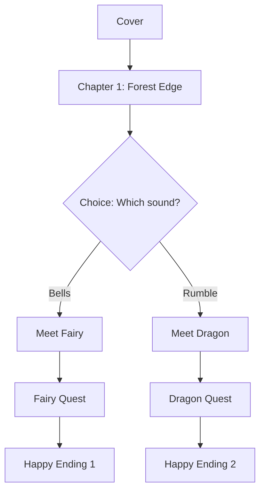

# Implementation Plan: /kidstory Command

## Executive Summary

Create an OpenCode agent command (`/kidstory`) that generates interactive stories for children ages 5-10, targeting the Lunii storyteller device format. The command uses a conversational interview process to gather story requirements, then generates story content in a progressive refinement workflow.

---

## 1. Project Structure

```
.opencode/
├── commands/
│   ├── kidstory.md              # Main command router
│   ├── kidstory-new.md          # New story creation
│   ├── kidstory-continue.md     # Continue incomplete story
│   ├── kidstory-edit.md         # Edit existing story
│   └── kidstory-export.md       # Export to Lunii archive
│
stories/                          # Output directory
├── {story-slug}/
│   ├── story.json               # Lunii format story structure
│   ├── metadata.json            # Story metadata & profile
│   ├── outline.md               # Story outline
│   ├── chapters/
│   │   ├── 01-cover.md          # Cover/intro chapter
│   │   ├── 02-chapter-name.md   # Story chapters
│   │   └── ...
│   ├── characters/
│   │   └── {character}.json     # Character audio profiles
│   ├── audio-scripts/
│   │   ├── {stage-uuid}.md      # TTS-ready scripts with director notes
│   │   └── ...
│   ├── assets/
│   │   ├── images/
│   │   │   └── {stage-uuid}.prompt.md   # AI image generation prompts
│   │   └── audio/
│   │       └── {stage-uuid}.wav         # Generated audio (after TTS)
│   └── validation-report.md     # Validation results
│
profiles/                         # Saved user profiles
└── {profile-name}.json          # Reusable preferences
```

---

## 2. Command Specifications

### 2.1 Main Router: `/kidstory`

**File:** `.opencode/commands/kidstory.md`

```markdown
---
description: Create interactive stories for kids (ages 5-10)
---

Route to the appropriate subcommand based on the argument:

- `/kidstory new [topic]` - Create a new story
- `/kidstory continue [story-name]` - Resume an incomplete story  
- `/kidstory edit [story-name]` - Modify an existing story
- `/kidstory export [story-name]` - Generate Lunii archive

If no argument provided, show available stories and prompt for action.
```

### 2.2 Subcommand: `/kidstory new`

**File:** `.opencode/commands/kidstory-new.md`

**Workflow:**
1. **Interview Phase** (Conversational)
2. **Outline Generation** (Review & Approve)
3. **Content Generation** (Progressive Refinement)
4. **Validation** (Interactive Fixes)

---

## 3. Interview System Design

### 3.1 Interview Flow

The interview is **conversational** and **adaptive**. Core questions are asked, with follow-ups based on answers.

#### Phase 1: Basics
| Topic | Question Type | Adapts Based On |
|-------|--------------|-----------------|
| Target age | Selection (5-6, 7-8, 9-10) | - |
| Language | Selection (24 Gemini TTS languages) | - |
| Story topic | Free text or suggestions | Age |
| Story type | Selection (narrative, educational, game) | Topic |

#### Phase 2: Structure
| Topic | Question Type | Adapts Based On |
|-------|--------------|-----------------|
| Story pattern | Selection (linear, branching, hub, loop, random) | Age, Type |
| Story length | Age-based default, adjustable | Age |
| Bedtime mode | Yes/No (enables autoplay) | Type |
| Ending philosophy | Selection (all positive, consequences, soft failures) | Age |

#### Phase 3: Content
| Topic | Question Type | Adapts Based On |
|-------|--------------|-----------------|
| Educational goals | Required text input | Type |
| Story tone | Selection (warm, exciting, mysterious, playful, calm) | Type |
| Templates vs custom | Selection | User preference |
| Personalization | Optional (child's name, etc.) | User choice |

#### Phase 4: Creation Mode
| Topic | Question Type | Adapts Based On |
|-------|--------------|-----------------|
| Creation mode | Selection (quick, guided, manual) | - |
| Profile save | Yes/No + name | - |

### 3.2 Age-Based Defaults

| Setting | Ages 5-6 | Ages 7-8 | Ages 9-10 |
|---------|----------|----------|-----------|
| Story duration | 5-10 min | 10-15 min | 15-20 min |
| Chapter duration | 3-5 min | 5-7 min | 7-10 min |
| Chapters per story | 2-3 | 2-3 | 2-3 |
| Pack duration | 45 min - 1h | 1h - 1h30 | 1h30 - 2h30 |
| Stories per pack | 5-7 | 5-6 | 6-8 |
| Branching complexity | 2 choices max | 4 choices | Unlimited |
| Vocabulary | Simple | Moderate | Advanced |
| TTS pace | 0.75x-0.85x | 0.9x-1.0x | 1.0x-1.1x |
| Director techniques | Simple | Moderate | Advanced |

---

## 4. Story Generation Workflow

### 4.1 Outline First Approach

After interview completion:

1. **Generate Outline**
   - Story arc (beginning, middle, end)
   - Chapter summaries
   - Character list with descriptions
   - Key plot points
   - Choice branches (if applicable)
   - Educational moment placements

2. **Review & Approval**
   - Display outline to user
   - Allow feedback and modifications
   - Iterate until approved

3. **Detailed Generation**
   - Generate full narrative for each chapter
   - Create character audio profiles
   - Generate stage nodes and transitions
   - Create image prompts
   - Create TTS-ready audio scripts

### 4.2 Creation Modes

| Mode | Description | User Involvement |
|------|-------------|------------------|
| **Quick** | AI generates everything | Review final output only |
| **Guided** | AI generates, user approves each phase | Approve outline, then chapters |
| **Manual** | User provides more input | Write plot points, AI expands |

---

## 5. Output Formats

### 5.1 Metadata File (`metadata.json`)

```json
{
  "id": "uuid-here",
  "title": "The Magic Forest Adventure",
  "slug": "magic-forest-adventure",
  "description": "A magical journey through an enchanted forest",
  "version": 1,
  "status": "draft|complete",
  "created": "2026-02-01T10:00:00Z",
  "modified": "2026-02-01T12:00:00Z",
  
  "target": {
    "ageRange": [7, 8],
    "language": "en-US"
  },
  
  "interview": {
    "storyType": "narrative",
    "pattern": "branching",
    "tone": "exciting",
    "educationalGoals": ["courage", "friendship"],
    "endingPhilosophy": "soft-failures",
    "bedtimeMode": false,
    "personalization": {
      "enabled": true,
      "childName": "Emma",
      "customElements": {}
    }
  },
  
  "generation": {
    "mode": "guided",
    "profileUsed": "emma-preferences",
    "outlineApproved": true,
    "chaptersGenerated": 5,
    "chaptersTotal": 8
  },
  
  "audio": {
    "narratorVoice": "Sulafat",
    "defaultPace": 0.9
  },
  
  "validation": {
    "lastRun": "2026-02-01T12:00:00Z",
    "passed": true,
    "warnings": [],
    "errors": []
  }
}
```

### 5.2 Chapter File Format (`chapters/02-entering-forest.md`)

```markdown
---
chapterNumber: 2
title: "Entering the Enchanted Forest"
stageUuid: "stage-entering-forest"
previousChapter: "01-cover"
nextChapters: ["03-meet-fairy", "03-meet-dragon"]
isChoicePoint: true
estimatedDuration: 45
---

# Chapter 2: Entering the Enchanted Forest

## Scene Description
The edge of a mysterious forest at golden hour. Ancient oak trees tower 
overhead, their leaves rustling with whispered secrets. Fireflies begin 
to emerge as twilight approaches.

## Narrative

Emma took a deep breath and stepped onto the mossy path. The forest 
welcomed her with the sweet scent of wildflowers and the gentle chirping 
of hidden birds.

"Hello?" she called softly. "Is anyone there?"

The trees seemed to lean closer, as if listening. Then, from deep within 
the forest, she heard two sounds...

To her left, a tinkling laugh like silver bells.
To her right, a low, friendly rumble.

## Choice Point

**Question to child:** "Which sound should Emma follow?"

- **Option 1:** Follow the tinkling laugh (leads to: 03-meet-fairy)
- **Option 2:** Follow the friendly rumble (leads to: 03-meet-dragon)

## Educational Moment
*Theme: Courage* - Emma shows bravery by stepping into the unknown forest.

## Content Warnings
None
```

### 5.3 Character Audio Profile (`characters/emma.json`)

```json
{
  "name": "Emma",
  "role": "protagonist",
  "voiceName": "Leda",
  "voiceCharacteristics": "Youthful",
  
  "audioProfile": {
    "identity": "A curious 8-year-old girl with boundless energy and a heart full of courage",
    "archetype": "Young Adventurer",
    "speakingStyle": "Wonder-filled, enthusiastic, occasionally breathless with excitement"
  },
  
  "directorsNotes": {
    "style": [
      "Bright and curious tone",
      "Voice rises with excitement during discoveries",
      "Slight hesitation when facing fears, but resolves with determination"
    ],
    "pacing": "Moderate with bursts of speed during exciting moments",
    "accent": "Neutral, clear American English"
  },
  
  "emotionalRange": {
    "excited": "Voice brightens, pace quickens slightly",
    "scared": "Softer, slight tremor, but maintains underlying courage",
    "determined": "Firm, clear, measured pace",
    "happy": "Vocal smile, melodic quality"
  }
}
```

### 5.4 Audio Script Format (`audio-scripts/stage-entering-forest.md`)

```markdown
---
stageUuid: "stage-entering-forest"
chapterRef: "02-entering-forest"
speakers: ["Narrator", "Emma"]
duration: 45
locale: "en-US"
---

# AUDIO PROFILE: Story Narrator
## "Warm Guide"

## THE SCENE: Forest Edge at Twilight
Golden sunlight filters through ancient oaks. The air is thick with 
the scent of pine and wildflowers. Magic tingles in the atmosphere 
as day transforms into evening.

### DIRECTOR'S NOTES

Style:
* Warm and inviting, like a beloved aunt telling a bedtime story
* Build gentle suspense without being scary
* "Vocal smile" on descriptions of beauty

Pacing: Moderate, with slight slowing for atmospheric moments

---

## TRANSCRIPT

**Narrator:** Emma took a deep breath... and stepped onto the mossy path. 
The forest welcomed her with the sweet scent of wildflowers, and the 
gentle chirping of hidden birds.

**Emma:** Hello? Is anyone there?

**Narrator:** The trees seemed to lean closer, as if listening. Then, from 
deep within the forest, she heard two sounds...

To her left... a tinkling laugh, like silver bells.

To her right... a low, friendly rumble.

Which sound should Emma follow?

---

## TTS CONFIGURATION

```json
{
  "model": "gemini-2.5-flash-preview-tts",
  "speakerConfigs": [
    {
      "speaker": "Narrator",
      "voiceName": "Sulafat"
    },
    {
      "speaker": "Emma", 
      "voiceName": "Leda"
    }
  ]
}
```
```

### 5.5 Image Prompt Format (`assets/images/stage-entering-forest.prompt.md`)

```markdown
---
stageUuid: "stage-entering-forest"
dimensions: "320x240"
style: "children's book illustration"
---

# Image Generation Prompt

## Scene
The edge of an enchanted forest at golden hour (twilight).

## Main Subject
An 8-year-old girl (Emma) with brown hair in a ponytail, wearing a 
blue dress and red boots, standing at the entrance to a magical forest.

## Environment
- Ancient oak trees with thick, gnarled trunks
- A mossy path leading into the forest
- Soft golden sunlight filtering through leaves
- Fireflies beginning to glow (3-5 visible)
- Wildflowers along the path edges (purple and yellow)

## Mood
Magical, inviting, slightly mysterious but not scary

## Art Style
- Warm, vibrant colors suitable for children
- Soft, rounded shapes
- Studio Ghibli-inspired whimsy
- Clear focal point on Emma
- Simple background details

## Technical Requirements
- Resolution: 320x240 pixels
- Format: PNG
- Color depth: 24-bit RGB
- Child-friendly, non-scary imagery

## Negative Prompt Elements (avoid)
- Dark shadows, scary elements
- Complex/cluttered composition
- Realistic proportions (keep stylized)
- Text or words in image
```

---

## 6. Lunii Story.json Generation

### 6.1 Node Generation Rules

| Story Element | Node Type | Control Settings |
|--------------|-----------|------------------|
| Cover | `cover` | wheel: false, ok: true, autoplay: false |
| Linear chapter | `stage` | wheel: false, ok: true, autoplay: bedtimeMode |
| Choice point | `stage` | wheel: true, ok: true, autoplay: false |
| Chapter ending | `stage` | ok: true (to next) or null (story end) |
| Story end | `stage` | ok: null, home: true |

### 6.2 Transition Generation

```javascript
// For linear flow
{
  "okTransition": {
    "actionNode": "action-to-next-chapter",
    "optionIndex": 0
  }
}

// For choice points
{
  "okTransition": {
    "actionNode": "action-choice-{chapter}",
    "optionIndex": 0  // Wheel selection determines actual option
  },
  "controlSettings": {
    "wheel": true  // Enable wheel for selection
  }
}

// For random events
{
  "okTransition": {
    "actionNode": "action-random-encounter",
    "optionIndex": -1  // Random selection
  }
}
```

---

## 7. Validation System

### 7.1 Validation Checks

| Category | Check | Severity |
|----------|-------|----------|
| **Structure** | Exactly one squareOne node | Error |
| **Structure** | squareOne is first in array | Error |
| **Structure** | All nodes reachable from squareOne | Warning |
| **Structure** | No orphaned nodes | Warning |
| **Transitions** | All actionNode IDs exist | Error |
| **Transitions** | All optionIndex values valid | Error |
| **Transitions** | All stage UUIDs in options exist | Error |
| **Transitions** | Exit path exists (null or home) | Error |
| **Assets** | All image references have prompts | Warning |
| **Assets** | All audio references have scripts | Warning |
| **Content** | Age-appropriate vocabulary | Warning |
| **Content** | Segment duration within limits | Warning |

### 7.2 Interactive Fix Flow

When validation finds issues:
1. Display categorized issues (errors first, then warnings)
2. For each error, offer fix options:
   - Auto-fix (if possible)
   - Manual guidance
   - Skip (mark for later)
3. Re-validate after fixes
4. Generate validation report

---

## 8. Profile System

### 8.1 Profile Structure (`profiles/emma-preferences.json`)

```json
{
  "name": "emma-preferences",
  "created": "2026-02-01T10:00:00Z",
  "lastUsed": "2026-02-01T12:00:00Z",
  
  "defaults": {
    "ageRange": [7, 8],
    "language": "en-US",
    "tone": "exciting",
    "creationMode": "guided",
    "bedtimeMode": false
  },
  
  "personalization": {
    "childName": "Emma",
    "favoriteColor": "blue",
    "petName": "Max",
    "customElements": {
      "favoriteAnimal": "dragon"
    }
  },
  
  "preferences": {
    "endingPhilosophy": "soft-failures",
    "educationalFocus": ["courage", "friendship", "curiosity"],
    "avoidThemes": ["separation", "loss"]
  }
}
```

---

## 9. Preview System

### 9.1 Text Summary
Display story overview with chapter list, character summary, and choice tree.

### 9.2 Visual Flow Diagram
Generate Mermaid diagram of story structure:



### 9.3 Interactive Walkthrough
Text-based story playthrough:
- Display chapter content
- Show choice options
- Track path taken
- Allow restart/branch switching

---

## 10. Model Configuration

### 10.1 Task-Appropriate Models

| Task | Recommended Model | Fallback |
|------|-------------------|----------|
| Interview & Planning | gemini-2.5-flash | claude-3.5-sonnet |
| Story Generation | gemini-2.5-pro | claude-3.5-sonnet |
| Audio Script Generation | gemini-2.5-flash | - |
| TTS Audio Generation | gemini-2.5-flash-preview-tts | - |
| Image Prompt Generation | gemini-2.5-flash | claude-3.5-sonnet |
| Validation | gemini-2.5-flash | any |

---

## 11. Implementation Phases

### Phase 1: Core Framework (MVP)
- [ ] Command router (`/kidstory`)
- [ ] Basic interview flow (`/kidstory new`)
- [ ] Outline generation
- [ ] Linear story generation
- [ ] Basic chapter markdown output
- [ ] Simple story.json generation

### Phase 2: Enhanced Generation
- [ ] Branching story support
- [ ] Character audio profiles
- [ ] TTS-ready audio scripts
- [ ] Image generation prompts
- [ ] Age-adaptive content

### Phase 3: Management & Polish
- [ ] Continue incomplete stories
- [ ] Edit existing stories
- [ ] Profile system
- [ ] Full validation with interactive fixes
- [ ] Preview system (all modes)

### Phase 4: Export & Integration
- [ ] Archive export (`/kidstory export`)
- [ ] Asset placeholder generation
- [ ] Full Lunii format compliance
- [ ] Documentation

---

## 12. File Deliverables

| File | Purpose | Priority |
|------|---------|----------|
| `.opencode/commands/kidstory.md` | Main command router | P0 |
| `.opencode/commands/kidstory-new.md` | New story creation | P0 |
| `.opencode/commands/kidstory-continue.md` | Resume stories | P1 |
| `.opencode/commands/kidstory-edit.md` | Edit stories | P1 |
| `.opencode/commands/kidstory-export.md` | Export to archive | P1 |
| `docs/story-templates.md` | Template library | P2 |
| `docs/voice-guide.md` | Voice selection guide | P2 |

---

## 13. Success Criteria

1. **Interview Completion**: User can complete interview in < 5 minutes
2. **Story Quality**: Generated stories are coherent and age-appropriate
3. **Format Compliance**: story.json passes Lunii validation
4. **Audio Quality**: TTS scripts produce natural-sounding speech
5. **User Control**: All three creation modes work as expected
6. **Iteration**: Users can refine stories through continue/edit commands
