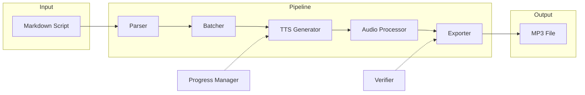
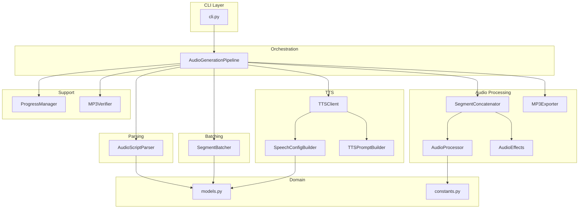
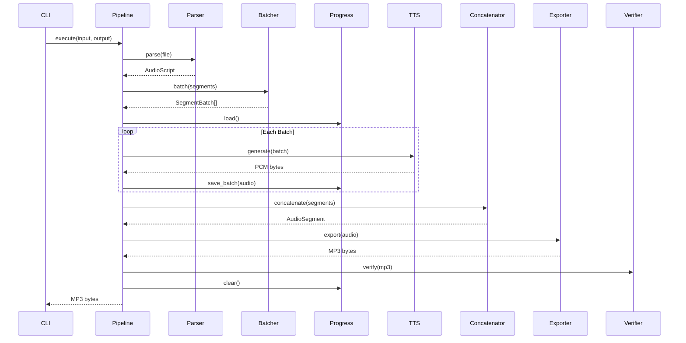
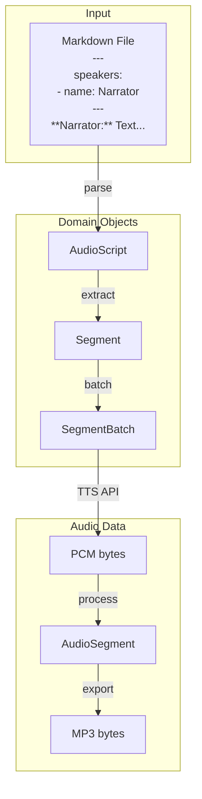

# Audio Generation Pipeline Architecture

## Overview

The audio generation system converts markdown audio scripts into MP3 files using Google's Gemini TTS API. The architecture follows clean code principles with single-responsibility components and dependency injection.

## High-Level Flow



## Component Architecture



## Sequence Diagram



## Package Structure

```
audio_generation/
├── __init__.py            # Package entry, exports AudioGenerationPipeline
├── cli.py                 # Entry point, argument parsing
├── orchestrator.py        # Pipeline coordinator
├── domain/
│   ├── __init__.py
│   ├── models.py          # Data classes (AudioScript, Segment, etc.)
│   └── constants.py       # Audio constants, voice mappings
├── parsing/
│   ├── __init__.py
│   └── script_parser.py   # Markdown/YAML parsing
├── batching/
│   ├── __init__.py
│   └── segment_batcher.py # TTS batch optimization
├── tts/
│   ├── __init__.py
│   ├── client.py          # Gemini API wrapper with retry
│   ├── config_builder.py  # Speech configuration
│   └── prompt_builder.py  # TTS prompt construction
├── audio/
│   ├── __init__.py
│   ├── processor.py       # PCM conversion, normalization
│   ├── effects.py         # Crossfade, comfort noise
│   ├── concatenator.py    # Segment joining with pauses
│   └── exporter.py        # MP3 export, ID3 stripping
├── verification/
│   ├── __init__.py
│   └── mp3_verifier.py    # Format validation
├── progress/
│   ├── __init__.py
│   └── progress_manager.py # Resume capability
└── utils/
    ├── __init__.py
    └── logging.py         # Logging configuration
```

## Component Responsibilities

| Component | Single Responsibility |
|-----------|----------------------|
| `AudioScriptParser` | Parse markdown with YAML frontmatter into domain objects |
| `SegmentBatcher` | Group segments into TTS-compatible batches (max 2 speakers) |
| `TTSClient` | Handle Gemini API calls with retry logic |
| `SpeechConfigBuilder` | Build TTS voice configurations |
| `TTSPromptBuilder` | Construct prompts with voice profiles and emotions |
| `AudioProcessor` | Convert PCM to AudioSegment, normalize audio |
| `AudioEffects` | Apply crossfades, generate comfort noise |
| `SegmentConcatenator` | Join segments with context-aware pauses |
| `MP3Exporter` | Export to MP3 format, strip ID3 tags |
| `MP3Verifier` | Validate output format (mono, 44.1kHz, no tags) |
| `ProgressManager` | Enable resume after failures |

## Data Flow



## Key Design Decisions

1. **Dependency Injection**: All components receive dependencies via constructor, enabling easy testing with mocks.

2. **Single Responsibility**: Each class has one reason to change - parser handles parsing, batcher handles batching, etc.

3. **Domain-Driven**: Pipeline expressed in business terms (parse, batch, generate, concatenate, export).

4. **Resume Capability**: Progress saved after each batch for fault tolerance against API rate limits.

5. **Professional Audio**: Comfort noise, non-linear crossfades, context-aware pauses for broadcast-quality output.

## Usage

### As CLI
```bash
# Using the wrapper script
python generate_audio.py audio-scripts/script.md -o output.mp3

# Using the package directly
python -m audio_generation.cli audio-scripts/script.md -o output.mp3
```

### As Library
```python
from audio_generation import AudioGenerationPipeline
from audio_generation.tts import TTSClient
from audio_generation.progress import ProgressManager

# Create pipeline
pipeline = AudioGenerationPipeline()

# Configure dependencies
pipeline.set_tts_client(TTSClient(api_key="...", model="gemini-2.5-flash-preview-tts"))
pipeline.set_progress_manager(ProgressManager(output_dir))

# Execute
mp3_data = pipeline.execute(
    input_file=Path("script.md"),
    output_path=Path("output.mp3"),
    resume=False,
    verify=True,
)
```
