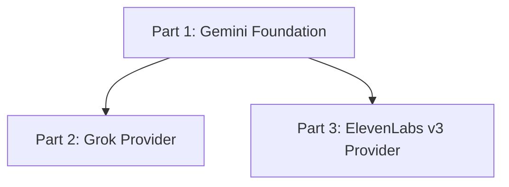

# Multi-Provider TTS Vertical Slices

## Decisions From Interview

These slices follow the implementation preferences selected during planning:

| Area | Decision |
| --- | --- |
| Organization | Use both planning directories and matching future code directories. |
| Slice size | Moderate vertical slices. Each slice should be independently reviewable. |
| Merge policy | Each slice should be PR-sized, leave tests passing, and avoid unusable dead code where possible. |
| Test policy | Tests are required for every slice. |
| Part 1 scope | Build the full generic foundation while improving Gemini. |
| Provider selection | CLI-first. Add `--provider`; config-file provider selection can come later. |
| Voice mapping | Add voice mapping foundation in Part 1, including global mapping and story overrides. |
| Grok scope | Minimal REST provider, one speaker per request, with basic emotion tag compilation. |
| ElevenLabs scope | Eleven v3 only in the first ElevenLabs part. Non-v3 behavior comes later. |
| Credentials | Environment variables only for this plan. |

## Three Parts

The work is organized into three directories:

```text
docs/tts-slices/
  01-gemini-foundation/
    plan.md
  02-grok-provider/
    plan.md
  03-elevenlabs-v3-provider/
    plan.md
```

The future code should be organized around the same three-stage rollout:

```text
audio_generation/
  providers/
    __init__.py
    base.py
    registry.py
    gemini.py
    grok.py
    elevenlabs.py
  emotion/
    __init__.py
    taxonomy.py
    normalizer.py
  voices/
    __init__.py
    models.py
    registry.py
    resolver.py
config/
  voice-map.yaml
```

## Vertical Slice Rules

Every slice should satisfy these rules:

| Rule | Requirement |
| --- | --- |
| User-visible value | Each slice should enable or protect a real behavior, even if small. |
| Tests | Add or update unit tests for every slice. Use fake providers for API-free coverage. |
| CLI safety | Do not require paid provider calls for validation or dry-run commands. |
| Compatibility | Existing Gemini generation should keep working throughout Part 1. |
| Voice safety | Voice resolution should be inspectable before any paid audio call. |
| Provider isolation | Grok and ElevenLabs code should not leak provider-specific syntax into generic models. |
| Final audio | All providers still pass through common export and verification before Lunii use. |

## Dependency Order



Part 2 and Part 3 both depend on Part 1. Part 3 can start before Part 2 is complete if the provider interfaces, voice resolver, and direction normalizer from Part 1 are merged.

## Acceptance Bar By Part

| Part | Acceptance bar |
| --- | --- |
| Part 1 | Gemini works through generic provider interfaces, `--provider gemini` works, voice roles resolve, dry-run voice/debug commands exist, tests pass. |
| Part 2 | `--provider grok` can generate a Lunii-valid MP3 through REST, basic tags compile safely, one-speaker batching works, tests pass without API calls. |
| Part 3 | `--provider elevenlabs --model eleven_v3` can generate a Lunii-valid MP3, v3 tags compile safely, v3-only errors are explicit, tests pass without API calls. |

## Suggested PR Sequence

| PR | Part | Slice |
| --- | --- | --- |
| 1 | Gemini Foundation | Add provider protocol and GeminiProvider wrapper. |
| 2 | Gemini Foundation | Add structured performance directions and Gemini compiler update. |
| 3 | Gemini Foundation | Add voice map models, resolver, story overrides, and dry-run voices. |
| 4 | Gemini Foundation | Add provider-aware batching and CLI `--provider gemini`. |
| 5 | Grok Provider | Add Grok REST client with fake-provider tests. |
| 6 | Grok Provider | Add Grok basic emotion tag compiler. |
| 7 | Grok Provider | Add Grok one-speaker batching, voice resolution, and MP3 normalization. |
| 8 | ElevenLabs v3 | Add ElevenLabs v3 REST client with fake-provider tests. |
| 9 | ElevenLabs v3 | Add Eleven v3 tag compiler and voice settings support. |
| 10 | ElevenLabs v3 | Add v3 CLI integration, validation, and final MP3 normalization. |

## Non-Goals For This Slice Set

These should not be included unless explicitly requested later:

| Non-goal | Reason |
| --- | --- |
| Grok streaming TTS | Minimal REST was selected first. |
| ElevenLabs non-v3 models | Eleven v3 first was selected. |
| ElevenLabs request stitching | Not applicable to v3 first and should be later. |
| Provider selection from config files | CLI-first was selected. |
| Automatic fallback provider execution | Voice mapping should support fallback later, but automatic fallback is not part of these first slices. |
| Full voice discovery implementation for all providers | Dry-run and validation come first; provider voice list APIs can be separate later. |
